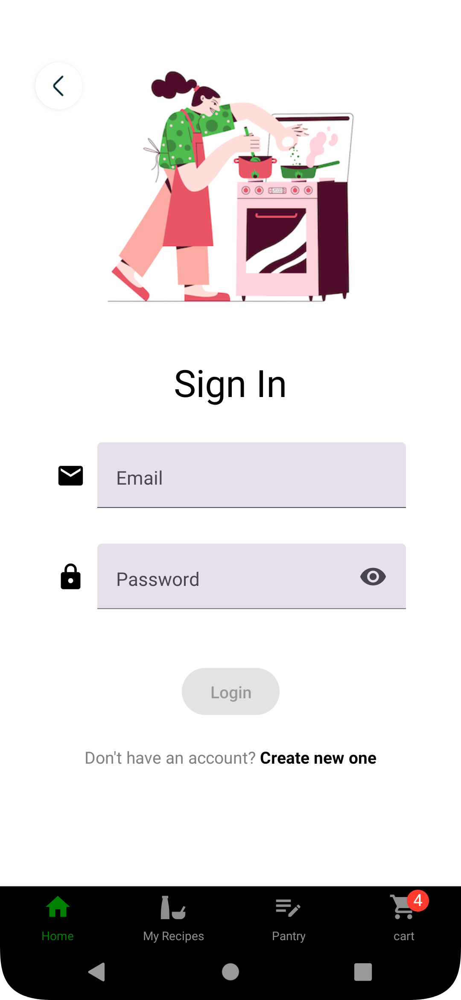

# Chef de Cuisine

Chef de Cuisine is a mobile app that simplifies cooking with pantry resources. Discover recipes, manage ingredients, and enhance your culinary experience.

## Key Features

### Pantry Management

- **Add/View Ingredients:**
  - Effortlessly manage and explore your pantry.
  
- **Discover Recipes:**
  - Find recipes based on available ingredients.

### Shopping Assistance

- **Create a Shopping List:**
  - Compile shopping lists for additional ingredients.
  
- **Locate Nearby Stores:**
  - Find convenient grocery stores.

### Recipe Discovery

- **Filter Recipes by Cuisines:**
  - Explore diverse cuisines.
  
- **Explore Based on Available Resources:**
  - Get recipe suggestions based on your pantry.

### User Interaction

- **Register to Add/Share Personal Recipes:**
  - Add and share your unique recipes.
  
- **QR Codes for Recipe Sharing:**
  - Easily share recipes using QR codes.

### User Experience

- **Cross-Platform Compatibility:**
  - Access Chef de Cuisine on both Android and iOS.
  
- **Dark Mode Layout:**
  - Enhance your experience with a sleek dark mode.

## Technical Specifications

- **Framework:** React-Native
- **Backend:** Express.js
- **APIs:** Spoonacular, Google Places
- **Database:** Google Firestore/AWS
- **Tools:** Visual Studio, Postman
- **Dependencies:** Internet connection
- **Platform:** Android/iOS

## User Roles

- **Guest User:**
  - Explore recipes and manage pantry.
  - Create shopping lists and find nearby stores.

- **Registered User:**
  - All guest functionalities.
  - Add/share personal recipes and use QR codes.

## Target Demographic

- Individuals who want to cook based on available supplies.
- Recipe enthusiasts and sharers.

## Screenshots

    
